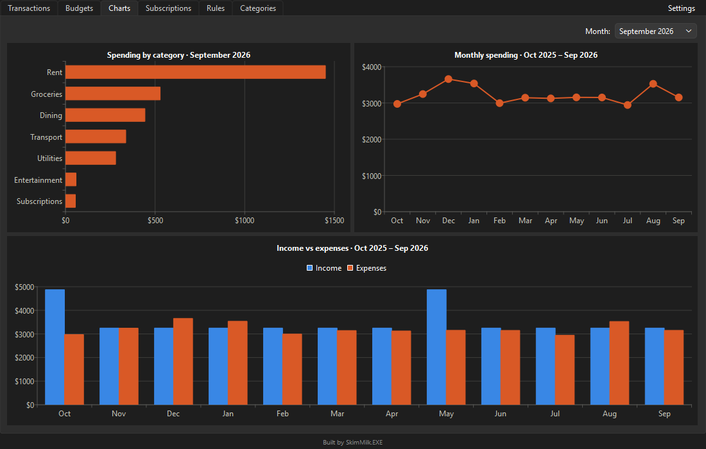
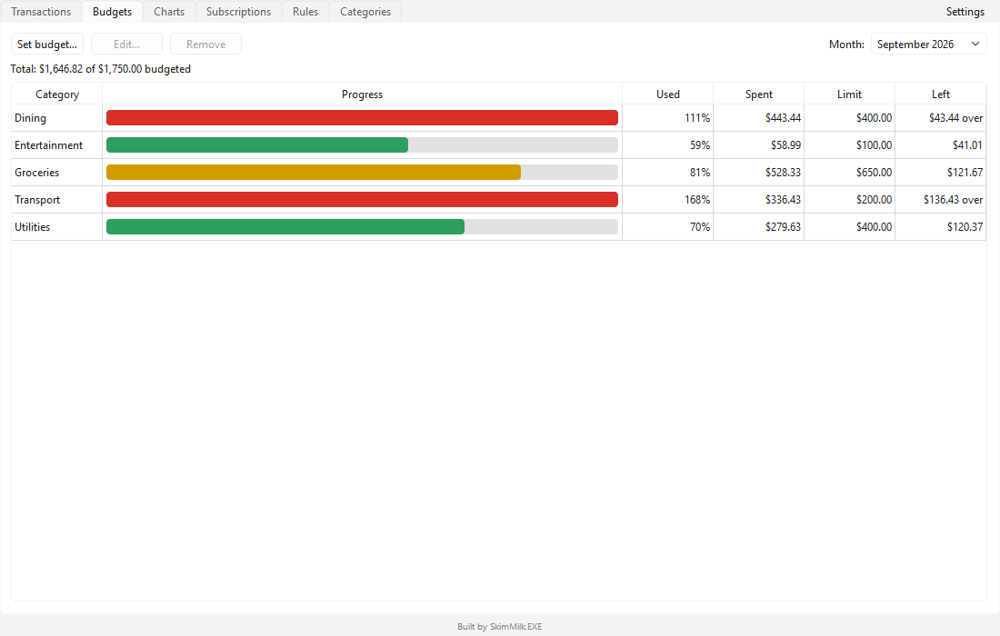
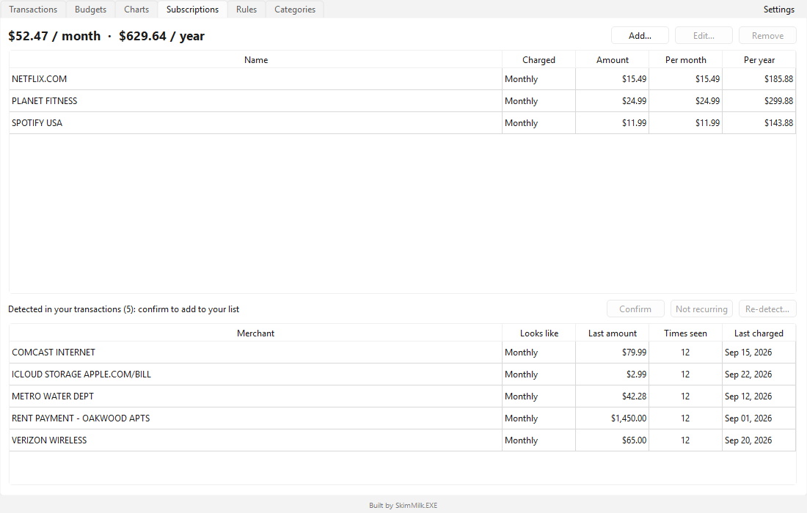
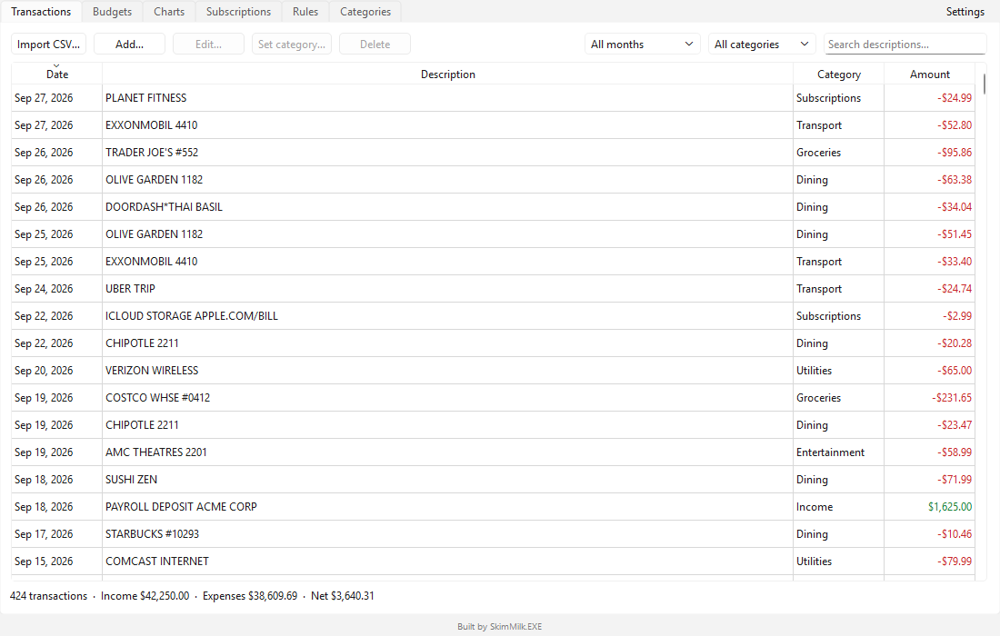
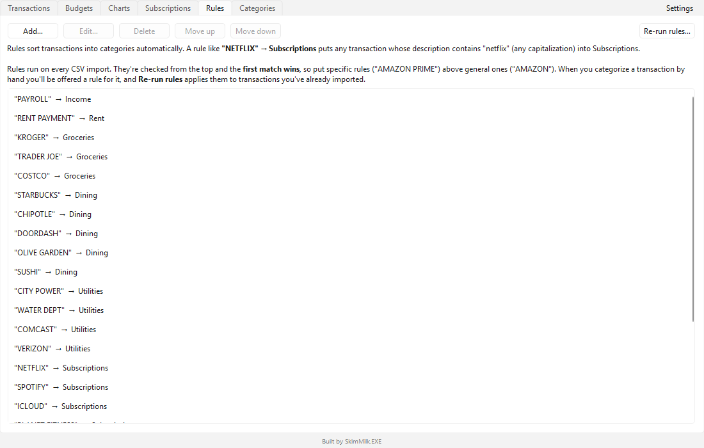

# SkimWise

*Skim the fat off your spending.*

SkimWise is a private, local-only desktop budget app. Import the CSV export from your bank, let rules sort
every transaction into a category, set monthly budgets, spot the subscriptions you forgot about, and see
where your money goes. No accounts, no cloud, no tracking: your data never leaves your PC.



## Download

Grab **`SkimWise.exe`** from the [latest release](../../releases/latest) and double-click it. There's nothing
to install. On first launch you can **explore a year of demo data** before importing your own.

> Windows may show "Windows protected your PC" because the app isn't code-signed. Click
> **More info → Run anyway**.

## Features

- **CSV import that copes with real bank exports.** Map columns once and save them as a *bank profile*,
  so later imports take one click. It handles preamble lines, debit/credit columns, `$1,234.56`, `(5.00)`,
  `5.00 DR`, European `1.234,56` and `;`-separated files, dates with times, and Excel's byte-order mark.
  **Duplicate detection** skips anything you've already imported, so overlapping statements are safe.
- **Rules**: "description contains STARBUCKS → Dining". They run on every import, and categorizing a
  transaction by hand offers to create one.
- **Monthly budgets** with progress bars that turn yellow near the limit and red over it.
- **Charts**: spending by category, the monthly trend, and income vs expenses.
- **Subscription finder** spots recurring charges (steady timing, similar amount) and totals them per
  month and per year.
- **Bulk edits**: select several transactions to categorize or delete them together.
- **Backup & restore**, light & dark themes, and your choice of date formats.

| Budgets | Subscriptions |
|---|---|
|  |  |

| Transactions | Rules |
|---|---|
|  |  |

## Privacy

Everything is stored in a single SQLite file on your PC (Settings → About shows where). SkimWise makes
no network connections. Use **Settings → Back up data…** to keep a copy somewhere safe.

## Build from source

Requires Python 3.12+.

```sh
python -m venv .venv
.venv\Scripts\activate            # Linux/macOS: source .venv/bin/activate
pip install -e ".[dev]"
python -m budget_tracker          # run the app
python -m pytest --cov=budget_tracker
```

Build the standalone executable (on the platform you're building for):

```sh
pip install -e ".[build]"
python scripts/build.py           # -> dist/SkimWise.exe
```

## How it's built

- **Python 3.12**, **PySide6** (Qt) for the UI and **QtCharts** for charts, **SQLite** for storage.
- Layered so the logic is testable without a UI: `ui/` → `services/` (plain Python, no Qt) → `db/` (all SQL).
- Money is stored as **integer cents**, never floats. The schema upgrades itself through versioned migrations.
- **120 tests** (pytest) cover import parsing, rules, budgets, recurring detection, backup/restore, and
  headless UI tests that drive the real window. Linted and formatted with **ruff**.

```
src/budget_tracker/
    main.py        app startup
    models/        dataclasses: Transaction, Category, Rule, BankProfile, RecurringItem
    db/            connection, migrations, repositories (all SQL lives here)
    services/      csv_import, rules, budgets, reports, recurring_detection, backup, demo
    ui/            main window and one view per tab
tests/             pytest suite + fake sample CSVs in tests/fixtures/
```

---

Built by **SkimMilk.EXE**
